# AURA IPTV

AURA is a source-first IPTV web application for organizing and playing media
from IPTV sources that the user already owns or is legally entitled to use.
It supports Xtream Codes credentials and M3U/M3U8 playlists while keeping the
catalog cache and playback preferences in the browser.

> AURA does not provide, host, sell, or promote channels, movies, series, or
> playlists. Users are responsible for the sources they connect.

## Product tour

The screenshots below were captured from the deployed application after adding
a temporary demo source. Credentials and source URLs are intentionally omitted
from this repository.

### Landing page

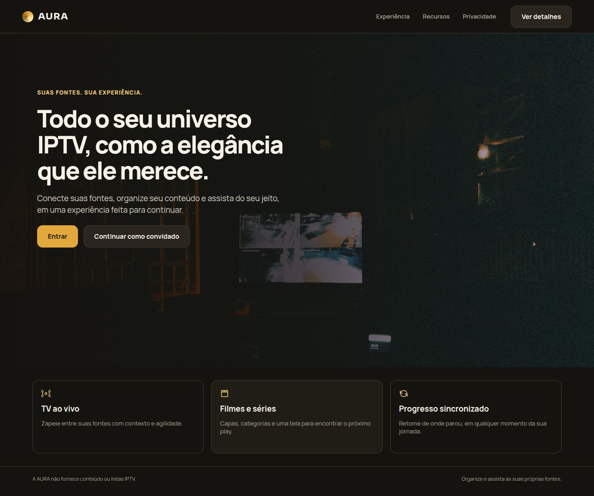

### Source management

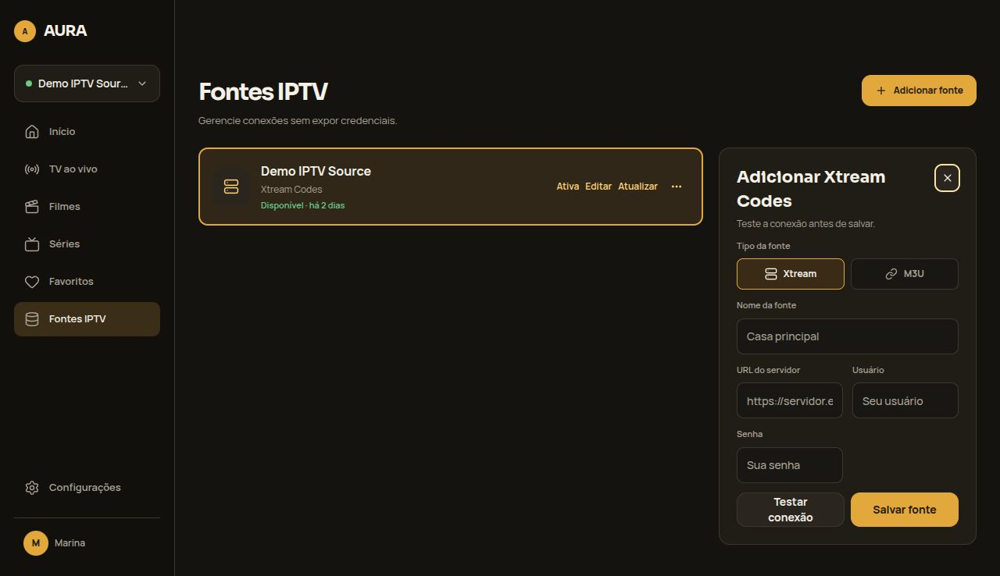

### Home and catalog browsing

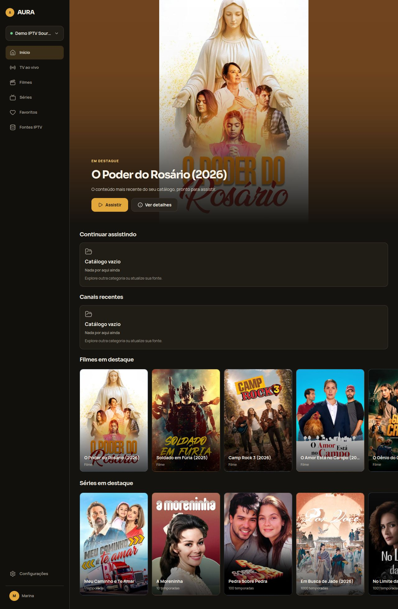

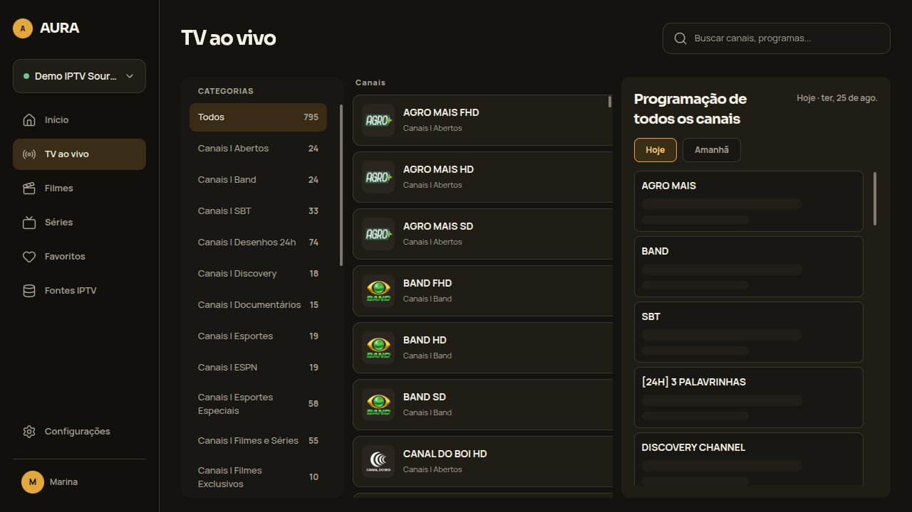

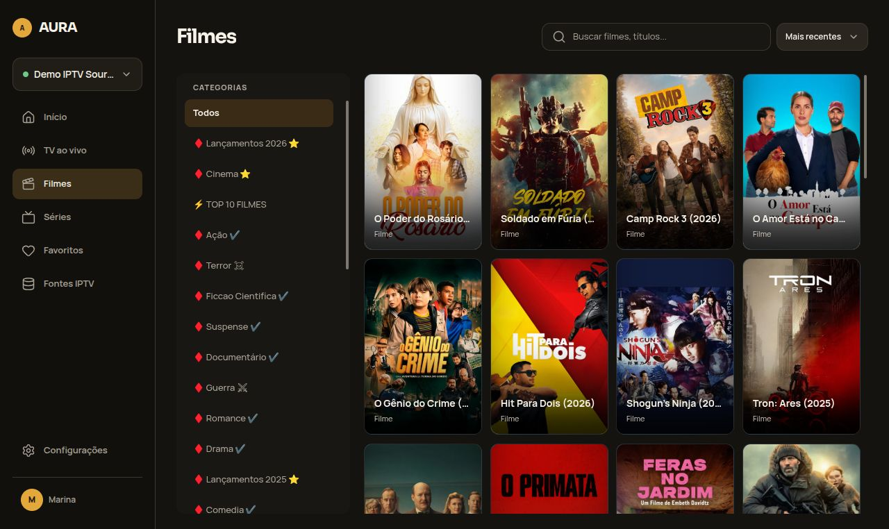

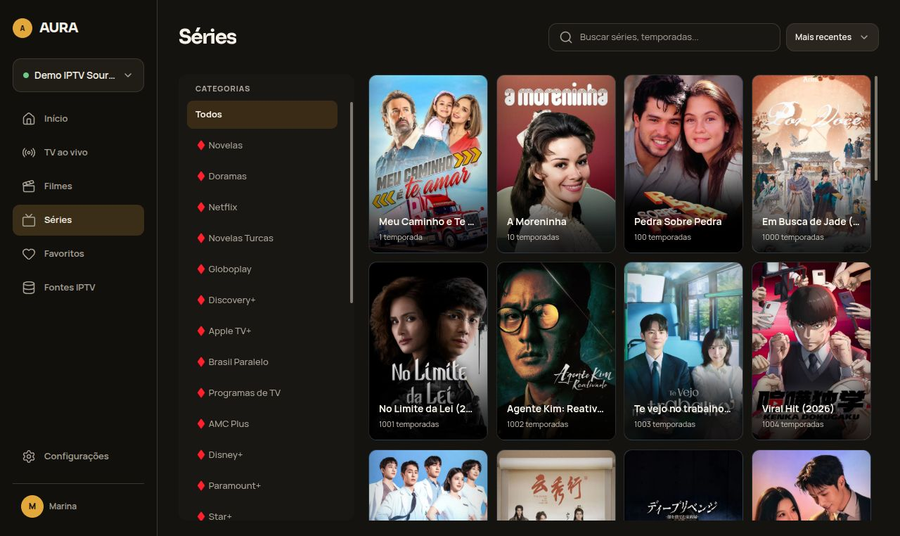

### Details and playback

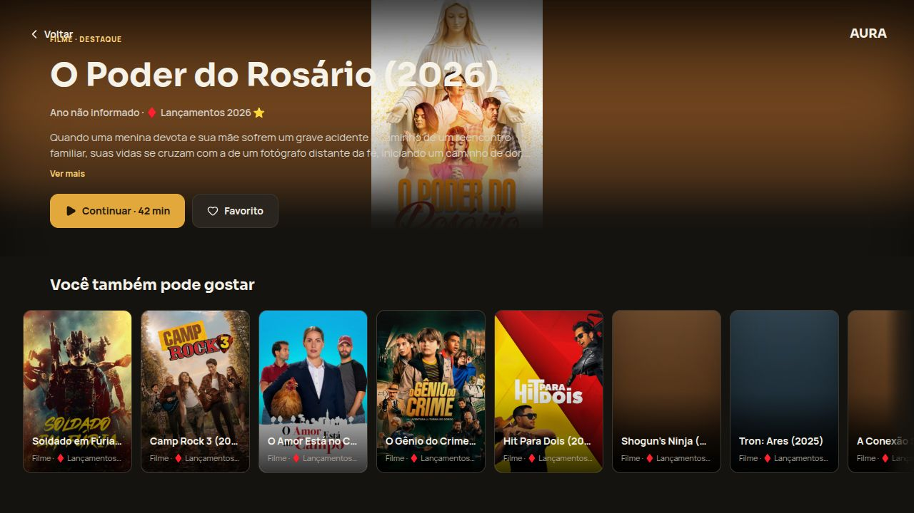

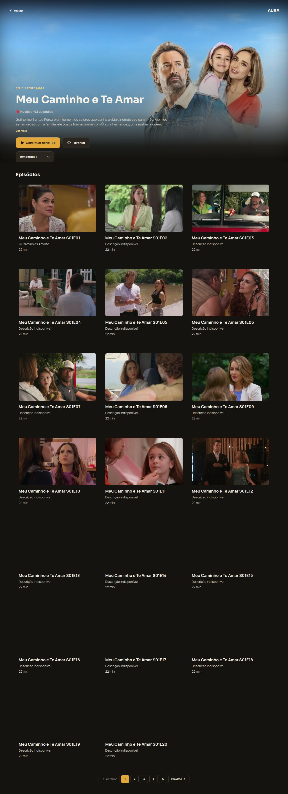

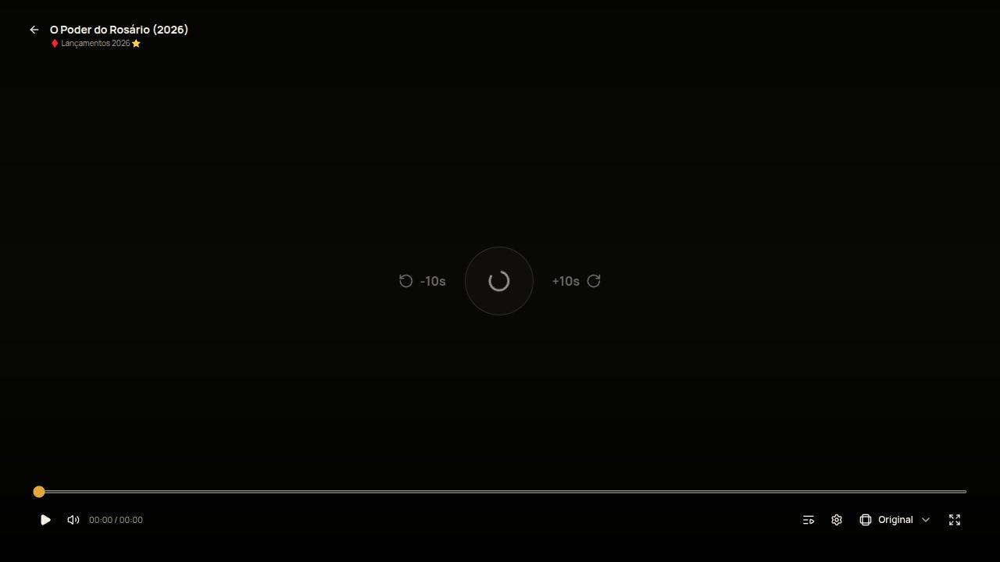

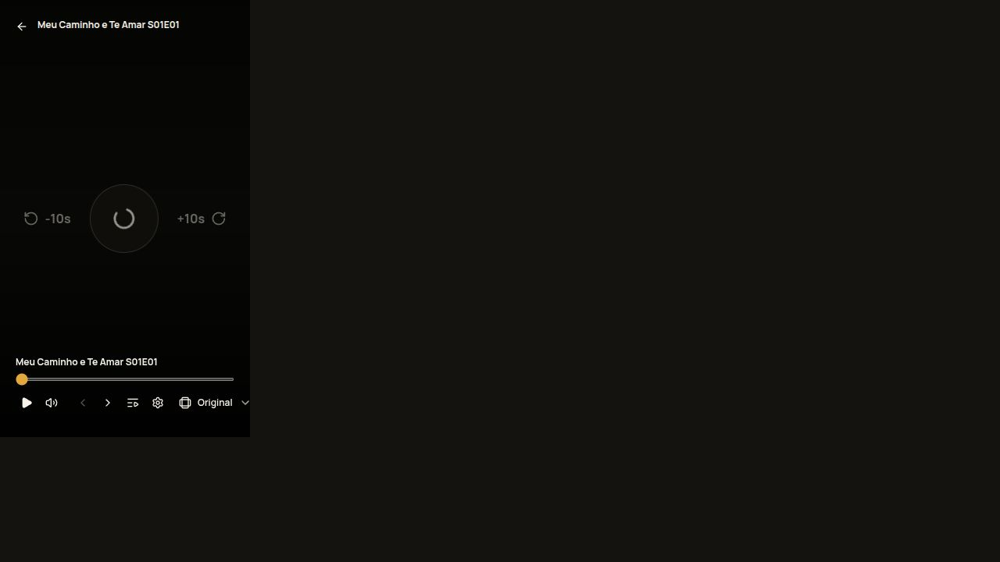

### Supporting screens

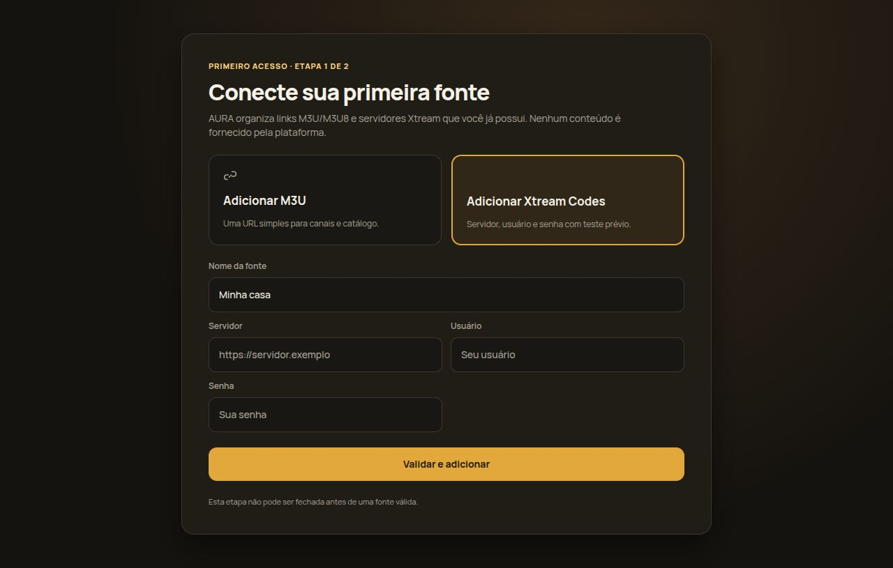

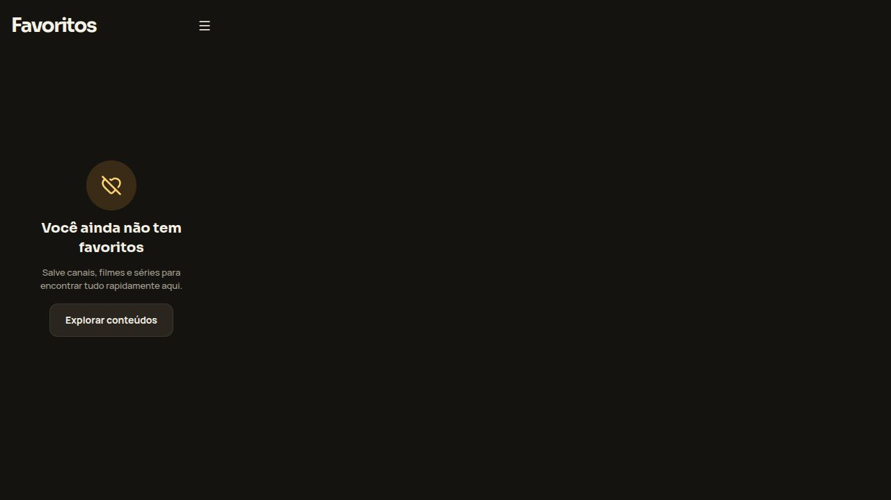

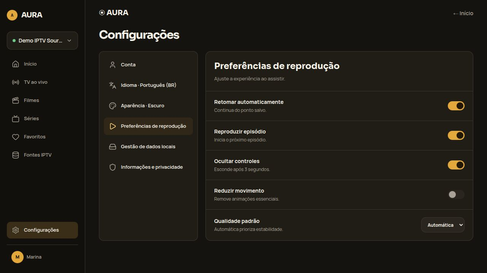

## Routes

The web application currently exposes the following TanStack Router routes:

| Route | Purpose |
| --- | --- |
| `/` | Public landing page |
| `/app` | Home dashboard and featured content |
| `/app/onboarding` | First-source setup flow |
| `/app/tv` | Live channel catalog |
| `/app/tv/$channelId/watch` | Live channel player |
| `/app/movies` | Movie catalog, search, sorting, and categories |
| `/app/movies/$movieId` | Movie details |
| `/app/movies/$movieId/watch` | Movie player |
| `/app/series` | Series catalog, search, sorting, and categories |
| `/app/series/$seriesId` | Series details and episode list |
| `/app/series/$seriesId/episodes/$episodeId/watch` | Episode player |
| `/app/favorites` | All favorites |
| `/app/favorites/movies` | Favorite movies |
| `/app/favorites/series` | Favorite series |
| `/app/favorites/channels` | Favorite channels |
| `/app/sources` | IPTV source management |
| `/app/settings` | Playback, appearance, language, and data settings |

`$channelId`, `$movieId`, `$seriesId`, and `$episodeId` are provider-backed
identifiers generated after a source is imported.

## Highlights

- Xtream Codes and M3U/M3U8 source onboarding.
- Browser-side catalog caching with source switching and refresh controls.
- Live TV, movie, and series catalogs with search and category filters.
- Movie and series detail pages with episode navigation.
- Playback progress, resume behavior, favorites, and recently watched channels.
- Responsive dark UI built around the AURA TV visual system.
- API-side provider validation and SSRF protections for Xtream requests.

## Architecture

This repository is a pnpm/Turborepo monorepo:

```text
apps/
├── api/    Fastify provider gateway and catalog normalization
└── web/    React/Vite application and browser-side catalog state
```

The web application uses React, Vite, TypeScript, Tailwind CSS, TanStack
Router, TanStack Query, Axios, React Hook Form, and Zod. The API uses Fastify,
Zod, and a strict provider allowlist for outbound IPTV requests.

See [`docs/architecture.md`](docs/architecture.md) for the architectural
boundaries and [`docs/deployment-vercel.md`](docs/deployment-vercel.md) for
the two-project Vercel deployment setup.

## Requirements

- Node.js 20 or newer
- pnpm 9.7.1 or newer

## Installation

```bash
pnpm install
```

## Development commands

```bash
pnpm dev
pnpm build
pnpm lint
pnpm typecheck
pnpm test
pnpm format
```

The web application lives in `apps/web` and the API lives in `apps/api`.
Configure local environment variables using the examples in
`apps/web/.env.example` and `apps/api/.env.example`. Never commit real source
credentials or `.env` files.

## Responsible use

Only connect sources that you own or are authorized to use. The demo source
used to capture the screenshots is not part of the codebase, and no provider
credentials are stored in this README.
